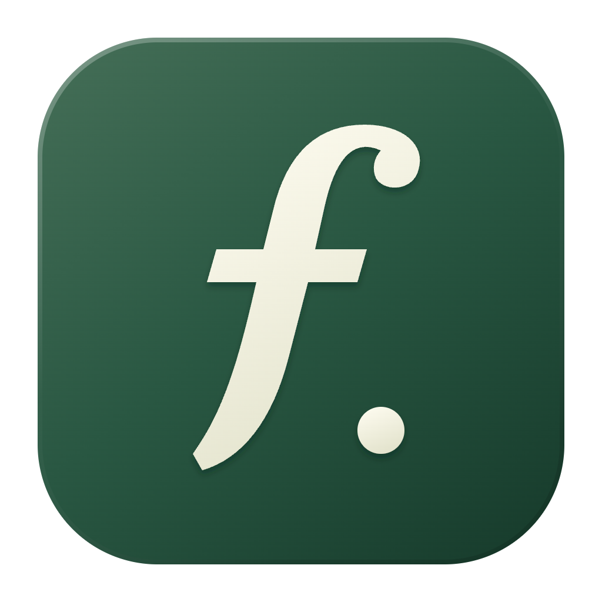

<div align="center">



<h1>FocusBae</h1>

<p><b>Record any meeting. Get the notes. Never lose a promise.</b></p>

<p>A free, open-source Mac app that records your calls with no bot joining,<br />
transcribes them on your Mac, and keeps track of who promised what to whom.</p>

<p>
  <a href="https://www.focusbae.com/download"><b>Download for Mac</b></a>
  &nbsp;•&nbsp;
  <a href="https://www.focusbae.com">Website</a>
  &nbsp;•&nbsp;
  <a href="https://discord.gg/vWugF4Rreb">Discord</a>
  &nbsp;•&nbsp;
  <a href="LICENSE">MIT License</a>
</p>

<p>
  <a href="https://discord.gg/vWugF4Rreb"></a>
  <a href="https://github.com/focusbae/focusbae/actions/workflows/ci.yml"></a>
  <a href="LICENSE"></a>
  
</p>

</div>

---

## Why FocusBae

Meeting notetakers write down what was said and stop there. The things that matter
most are the small promises: *"I'll send the proposal Thursday"*, *"let me check
with finance"*. They are too small for a ticket and too important to forget, and
they quietly die.

FocusBae hears them, keeps the exact words as proof, and shows you what you owe
each person and what they owe you, until it is done.

- **No bot in the call.** It records your Mac's microphone and system audio, so it
  works with Zoom, Meet, Teams, Slack, a browser call or a phone on speaker.
- **Private by default.** Recording, transcription, speakers, notes and action
  items all run on your Mac. No account. Nothing is uploaded.
- **Free and open source.** MIT licensed. No limits on minutes or meetings.

## What it does

| | |
| --- | --- |
| **Record** | Microphone, system audio or both. Name the recording, pick the language, save it to any note. |
| **Transcribe on device** | Apple's speech engine on macOS 26, with optional Parakeet for higher English accuracy. Hindi and mixed Hindi-English are supported (experimental). |
| **Know who spoke** | On-device speaker detection. Mark "This is me" once and your promises are yours. |
| **Find the promises** | Suggested action items, each with the **exact quote** it came from, an owner (or "unknown", never a guess) and a due date. Accept, edit or dismiss. Nothing is sent or done for you. |
| **Keep the ledger** | *What I owe*, *waiting on*, and **People**: what you owe Priya and what Priya owes you. Re-promised items show **"promised 3 times"**. |
| **Write** | Daily notes, folders, `[[links]]` and backlinks, tabs, a graph view, images and files. Run **Find commitments** on any typed page. |
| **Bring your notes** | Import your Apple Notes library; export Markdown any time. |
| **Search** | Notes, transcripts and actions in one search, on your Mac. |
| **Stay safe** | Full workspace backup and restore. **Strict Local** blocks every network request, including updates. |

## What runs where

| Part | Where |
| --- | --- |
| Audio capture and recording | Your Mac. Temporary audio is removed after transcription unless you keep it. |
| Transcription, speaker detection | Your Mac (Apple SpeechAnalyzer, Parakeet, FluidAudio) |
| Action items, search | Your Mac (Apple Foundation Models with a rule-based fallback, local embeddings) |
| Notes and the ledger | A SQLite database and files on your Mac |
| Network | Only when you ask: downloading an optional model or checking for an update. Strict Local turns even that off. |

Startup makes **zero network connections**; `npm run test:local:network` proves it
on every change.

## Requirements

- Apple Silicon Mac (M1 or later)
- macOS 26 or later

## Install

Download the signed, notarized app from **[focusbae.com/download](https://www.focusbae.com/download)**,
open the DMG and drag FocusBae to Applications. Updates are offered in Settings
and installed only when you choose.

## Build from source

You need macOS 26+, Xcode 26+ and Node.js 22.

```bash
git clone https://github.com/focusbae/focusbae.git
cd focusbae
npm install
npm start
```

`npm start` compiles the Swift helpers (speech, extraction, embeddings, speaker
detection) and the React UI, then opens the app. See
[CONTRIBUTING.md](CONTRIBUTING.md) for tests.

## How it is built

- **Electron** shell (`local-first-main.js`, `workspace-window.js`) with a
  **React + TipTap** UI in `desktop-ui/`
- **`workspace/`**: storage (SQLite with WAL and migrations), notes, actions,
  people, restatements, search, backup
- **`recording/`** and **`meeting-capture/`**: capture, durable audio spool,
  segmentation, transcription, diarization
- **`local-ai/`**: Swift helpers for Apple Foundation Models, embeddings and
  FluidAudio
- **`privacy/`**: the local network policy and Strict Local
- Data model and design decisions: [`docs/`](docs/README.md)

## Roadmap

Next up: microphone recovery when headphones connect, meeting detection, voices
recognised across meetings, on-device summaries, audio file import, a Homebrew
cask and a local MCP server so Claude or ChatGPT can answer "what do I owe Priya?".
Each item is a [GitHub issue](https://github.com/focusbae/focusbae/issues).

## Community

**[Join the FocusBae Discord](https://discord.gg/vWugF4Rreb)**: ask questions, share
how you use it, suggest features and talk to the people building it.

- **Found a bug?** [Open an issue](https://github.com/focusbae/focusbae/issues/new/choose).
- **Want to help?** Start with an issue labelled
  [`good first issue`](https://github.com/focusbae/focusbae/labels/good%20first%20issue)
  or [`help wanted`](https://github.com/focusbae/focusbae/labels/help%20wanted),
  and read [CONTRIBUTING.md](CONTRIBUTING.md).
- **Security issue?** Report it privately; see [SECURITY.md](SECURITY.md).

## License

[MIT](LICENSE) © Prateek Saxena
